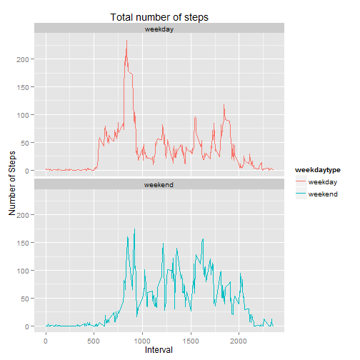

## Loading and preprocessing the data
Unzip the activity.zip file and load the data in R object named activity. As file is already provided in the repository. So, no need to download the file separately. 


```r
library(ggplot2)
unzip("activity.zip")
activity <- read.csv("activity.csv", header = TRUE)
```

## What is mean total number of steps taken per day?
For this part of the assignment, you can ignore the missing values in the dataset.

  1. Make a histogram of the total number of steps taken each day

```r
## Calculate total number of steps taken each day(ignored NA values)
dailyactivity <- aggregate(steps ~ date, activity, sum)
## Plot the histogram
ggplot(dailyactivity, aes(y=steps, x = date)) + geom_bar(postition = "dodge", stat="identity") + xlab("Date") + ylab("Total Steps") + ggtitle("Total number of steps per day") + theme(axis.text.x=element_text(angle = -90, hjust = 0))
```

 

  2. Calculate and report the mean and median total number of steps taken per day(NA values already ignored in dailyactivity object)

```r
mean(dailyactivity$steps)
```

```
## [1] 10766.19
```

```r
median(dailyactivity$steps)
```

```
## [1] 10765
```

## What is the average daily activity pattern?
1. Make a time series plot (i.e. type = "l") of the 5-minute interval (x-axis) and the average number of steps taken, averaged across all days (y-axis)

```r
intervalsteps <- aggregate(steps ~ interval, activity, mean)
ggplot(intervalsteps, aes(x = interval, y=steps)) + geom_line() + ggtitle("Average steps - 5-minute interval")
```

 

2. Which 5-minute interval, on average across all the days in the dataset, contains the maximum number of steps?

This can be done with first identify the maximum number of steps in intervalsteps object then fetch the result:

```r
intervalsteps[which.max(intervalsteps$steps), ]
```

```
##     interval    steps
## 104      835 206.1698
```

Therefore, the interval 835 has the maximum number of steps.

## Imputing missing values
Note that there are a number of days/intervals where there are missing values (coded as NA). The presence of missing days may introduce bias into some calculations or summaries of the data.

Calculate and report the total number of missing values in the dataset (i.e. the total number of rows with NAs)

```r
sum(is.na(activity$steps))
```

```
## [1] 2304
```
Thus, total number of rows with NAs: 2304

Devise a strategy for filling in all of the missing values in the dataset. The strategy does not need to be sophisticated. For example, you could use the mean/median for that day, or the mean for that 5-minute interval, etc.

Create a new dataset that is equal to the original dataset but with the missing data filled in.

I used the pre calculated mean for that 5-minute interval to fill the values. 

```r
newactivity <- merge(activity, intervalsteps, by = "interval", suffixes = c("", ".mean"))
newactivity$steps[is.na(newactivity$steps)] <- newactivity$steps.mean[is.na(newactivity$steps)]
newactivity <- newactivity[, c(1:3)]
```

Here is the sample of new dataset after transformation.

```
##    interval     steps       date
## 1         0  1.716981 2012-10-01
## 2         0  0.000000 2012-11-23
## 3         0  0.000000 2012-10-28
## 4         0  0.000000 2012-11-06
## 5         0  0.000000 2012-11-24
## 6         0  0.000000 2012-11-15
## 7         0  0.000000 2012-10-20
## 8         0  0.000000 2012-11-16
## 9         0  0.000000 2012-11-07
## 10        0  0.000000 2012-11-25
## 11        0  1.716981 2012-11-04
## 12        0  0.000000 2012-11-08
## 13        0  0.000000 2012-10-12
## 14        0  0.000000 2012-10-30
## 15        0  0.000000 2012-11-26
## 16        0 47.000000 2012-10-04
## 17        0  0.000000 2012-11-27
## 18        0  0.000000 2012-10-31
## 19        0  0.000000 2012-11-18
## 20        0  0.000000 2012-10-05
```

Make a histogram of the total number of steps taken each day and Calculate and report the mean and median total number of steps taken per day. Do these values differ from the estimates from the first part of the assignment? What is the impact of imputing missing data on the estimates of the total daily number of steps?

```r
newdailyactivity <- aggregate(steps ~ date, newactivity, sum)
ggplot(newdailyactivity, aes(y=steps, x = date)) + geom_bar(postition = "dodge", stat="identity") + xlab("Date") + ylab("Total Steps") + ggtitle("Total number of steps per day") + theme(axis.text.x=element_text(angle = -90, hjust = 0))
```

 

Calculate mean and median total number of steps from new dataset

```r
mean(newdailyactivity$steps)
```

```
## [1] 10766.19
```

```r
median(newdailyactivity$steps)
```

```
## [1] 10766.19
```

The mean and median values calculated above with and without NAs has no difference or seems to be close enough. Which indicates that replacing NAs with mean value of 5-minute interval has no significance to the dataset or the analysis performed is identical.

## Are there differences in activity patterns between weekdays and weekends?
For this part the weekdays() function may be of some help here. Use the dataset with the filled-in missing values for this part.

Create a new factor variable in the dataset with two levels - "weekday" and "weekend" indicating whether a given date is a weekday or weekend day.

```r
weekdaytype <- function(day)
  {
  if(weekdays(as.Date(day)) %in% c("Monday", "Tuesday", "Wednesday", "Thursday", "Friday"))
    {
    "weekday"
    }
  else
    {
      "weekend"
    }
  }
activity$weekdaytype <- as.factor(sapply(activity$date, weekdaytype))
```

Make a panel plot containing a time series plot (i.e. type = "l") of the 5-minute interval (x-axis) and the average number of steps taken, averaged across all weekday days or weekend days (y-axis). See the README file in the GitHub repository to see an example of what this plot should look like using simulated data.


```r
weekactivity <- aggregate(steps ~ interval + weekdaytype, data = activity, FUN=mean, na.rm = TRUE)

## plot the graph
ggplot(weekactivity, aes(y=steps, x = interval, group = weekdaytype, color = weekdaytype)) + geom_line() + xlab("Interval") + ylab("Number of Steps") + ggtitle("Total number of steps") + facet_wrap( ~ weekdaytype, nrow=2, ncol=1)
```

 
